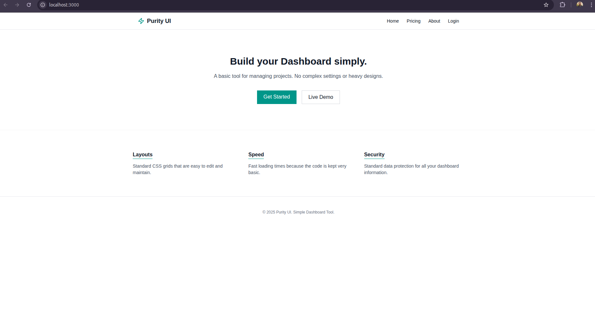
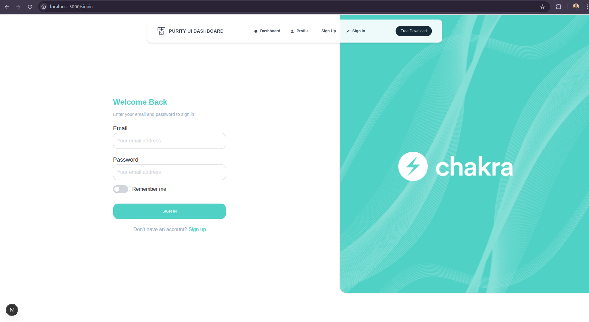
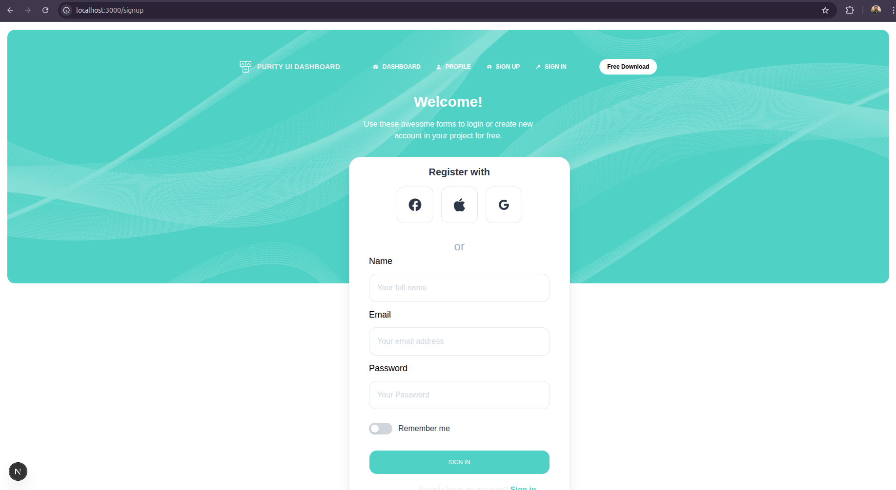
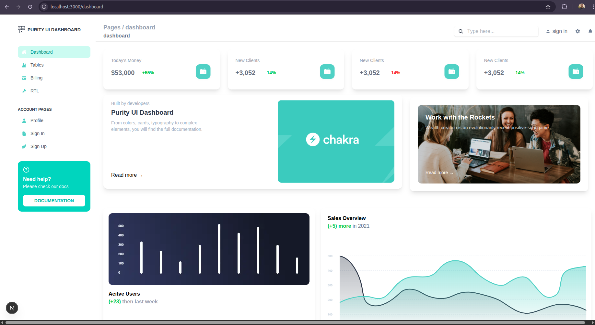
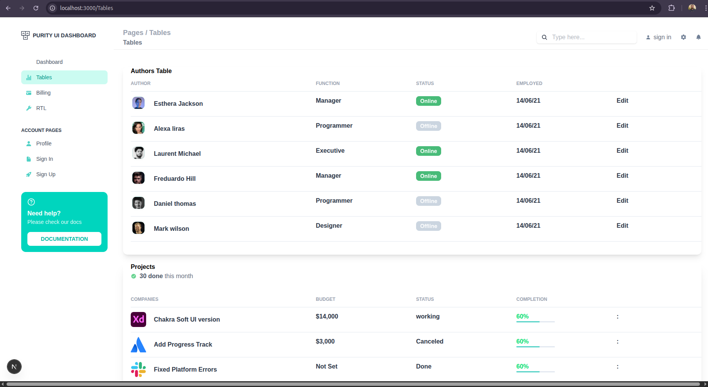
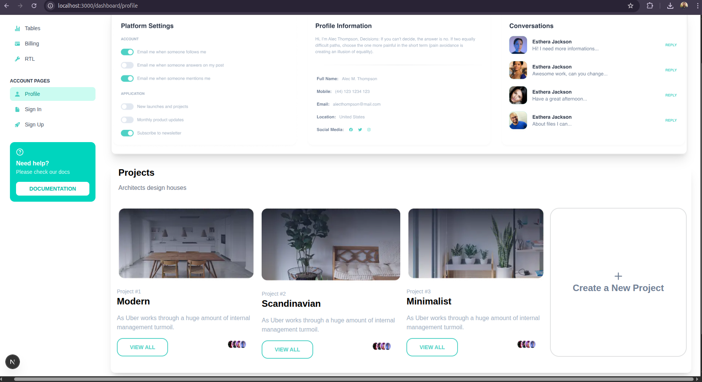

# Week — Chakra AI Frontend (Next.js)

## Overview

In this week, we built the **Chakra AI Frontend** using the **Next.js framework** with the **App Router architecture** and **Tailwind CSS** for styling.  
The focus was on creating a **modern, responsive, and scalable UI** with reusable components and a clean project structure.

The application includes authentication pages, a dashboard-driven layout, data tables, and a landing page, following real-world frontend development practices.

---

## Tech Stack Used

- **Framework:** Next.js (App Router)
- **Styling:** Tailwind CSS
- **Language:** JavaScript
- **UI Architecture:** Component-based design
- **State & Providers:** Context / Providers (AOS animations)
- **Animations:** AOS (Animate on Scroll)

---

## Features Implemented

- Fully responsive UI using Tailwind CSS
- Authentication pages (Sign In / Sign Up)
- Dashboard layout with sidebar navigation
- Reusable UI components
- Data tables page
- Profile management UI
- Landing page with animations
- Modular folder structure for scalability

---

## Project Structure (High Level)

components/
├── accountPages/
├── billing/
├── dashboard/
├── rtl/
├── Tables/
└── ui/
├── Badge.js
├── Button.js
├── Card.js
├── Input.js
├── Modal.jsx
├── Navbar.js
├── Sidebar.js
├── SignNav.js
├── SignupNav.js
└── AOSProvider.js

app/
├── signin/
├── signup/
├── favicon.ico
├── globals.css
├── layout.js
├── page.js
└── not-found.js

---

## Pages Implemented

### 1. Landing Page
The landing page introduces the Chakra AI platform and highlights key features with animations and a clean UI.

---

### 2. Sign In Page
User authentication page allowing existing users to log in.

---

### 3. Sign Up Page
User registration page for new users.

---

### 4. Dashboard Page
Main application dashboard displaying key insights and navigation options.

---

### 5. Tables Page
Page displaying structured data using reusable table components.

---

### 6. Profile Page
User profile page to view and manage personal account details.

---

## UI Components

All common UI elements were abstracted into reusable components such as:
- Buttons
- Inputs
- Cards
- Badges
- Navbar
- Sidebar
- Modals

This ensures:
- Consistent UI
- Easier maintenance
- Scalability for future features

(Refer to `UI-COMPONENT.md` for detailed UI documentation.)

---

## Learning Outcomes

- Practical experience with **Next.js App Router**
- Building scalable frontend architectures
- Creating reusable UI components
- Styling complex layouts using **Tailwind CSS**
- Organizing real-world frontend projects
- Implementing animations and responsive design

---

## Future Improvements

- Integrate backend APIs
- Add role-based access control
- Improve accessibility (ARIA support)
- Add dark/light theme toggle
- Implement form validation and error handling

