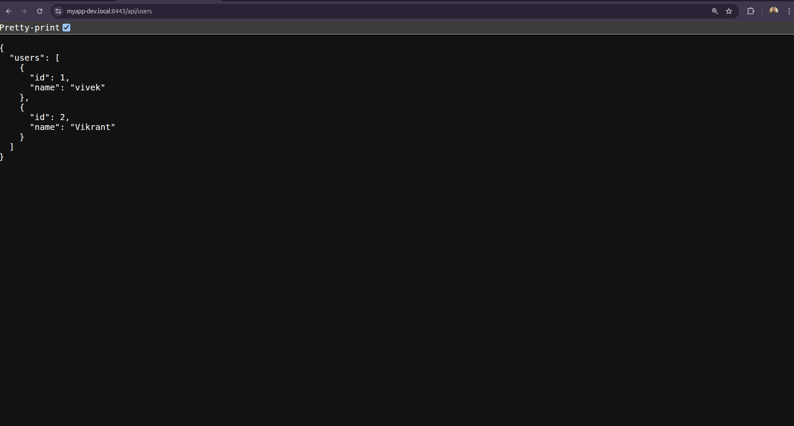
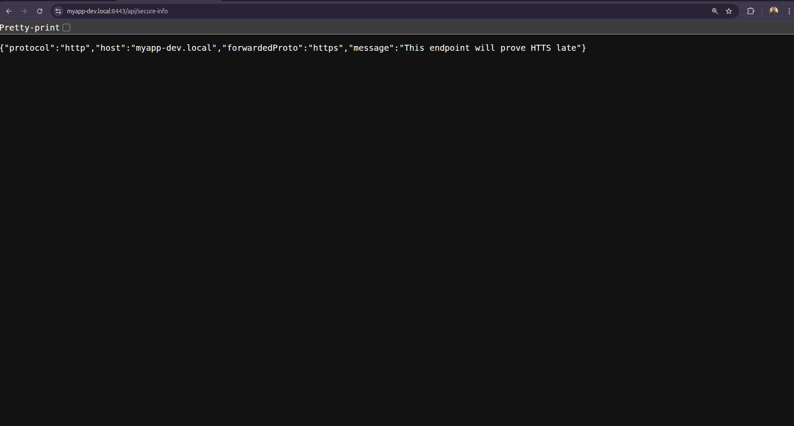
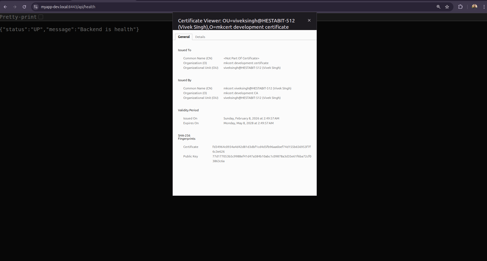

# DAY 4 — SSL + Self-Signed Certificates + mkcert + HTTPS

## Overview

On **Day 4**, HTTPS was enabled in a local development environment using **mkcert** for generating trusted self-signed certificates and **NGINX** as a reverse proxy.

NGINX is responsible for **SSL/TLS termination**, while the backend Express server continues to run over **HTTP** inside the Docker network.  
This setup closely resembles how HTTPS is handled in real production systems.

---

## Topics Covered

- SSL / TLS fundamentals  
- Self-signed certificates  
- Trusted local certificates using mkcert  
- HTTPS termination at NGINX  
- HTTP → HTTPS redirection  
- Reverse proxying backend services  

---

## Objectives

- Enable HTTPS locally using mkcert  
- Configure NGINX with SSL certificates  
- Force redirect from HTTP to HTTPS  
- Validate browser trust (lock icon)  
- Access backend routes securely via HTTPS  

---

## Local Domain Configuration

A local domain is used to simulate a production-like setup.

### Hosts File Entry

The following entry was added to the system hosts file:

`127.0.0.1 myapp-dev.localhost`


This allows accessing the application using a domain instead of `localhost`.

---

## SSL Setup Using mkcert

### Certificate Generation

Certificates were generated using **mkcert** for the local domain:

- `myapp-dev.localhost.pem`  
- `myapp-dev.localhost-key.pem`  

These certificates are trusted by the local system and browser.

### Certificate Usage

The generated certificates are mounted inside the NGINX container and used to enable HTTPS on port **443**.

---

## HTTPS Termination at NGINX

NGINX is configured to:

- Listen on HTTP (80) and HTTPS (443)  
- Redirect all HTTP requests to HTTPS  
- Terminate SSL/TLS  
- Forward requests to the backend service over HTTP  
- Preserve protocol information using headers  

Backend services do not handle SSL directly.

---

## Backend Server Implementation

An Express backend server was created with multiple routes to verify HTTPS behavior.

### Available Routes

- `/api/health`  
- `/api/users` (GET)  
- `/api/users` (POST)  
- `/api/secure-info`  

---

## Route: Health Check

### Endpoint

GET /api/health


### Purpose

- Verify backend availability  
- Confirm routing through NGINX over HTTPS  

### Expected Response

```json
{
  "status": "UP",
  "message": "Backend is health"
}
```

### Screenshot

Route: Get Users
Endpoint
GET /api/users
Purpose
Fetch list of users from backend

Validate secure data access via HTTPS

Expected Response
```json
{
  "users": [
    { "id": 1, "name": "vivek" },
    { "id": 2, "name": "Vikrant" }
  ]
}
```

## Screenshot

Route: Secure Info
Endpoint
GET /api/secure-info
Purpose
Confirm HTTPS termination at NGINX

Verify forwarded protocol headers

`Expected Response`
```json
{
  "protocol": "http",
  "host": "myapp.local",
  "forwardedProto": "https",
  "message": "This endpoint will prove HTTPS layer"
}
```
Verification
This confirms:

Client connects using HTTPS

Backend still receives HTTP

NGINX correctly forwards protocol information

`Screenshot`


HTTP → HTTPS Redirection
All HTTP requests are forcefully redirected to HTTPS.

Example
http://myapp.local:8082/api/health
Automatically redirects to:

https://myapp.local:8443/api/health

`Browser Trust Verification`

The browser shows a lock icon, confirming:

Certificate is trusted

Connection is secure

HTTPS is correctly configured

`Final Outcome`
```
HTTPS successfully enabled in local development

SSL certificates generated and trusted using mkcert

NGINX terminates SSL and proxies requests

Backend services work securely over HTTPS

Production-like HTTPS behavior achieved locally
```