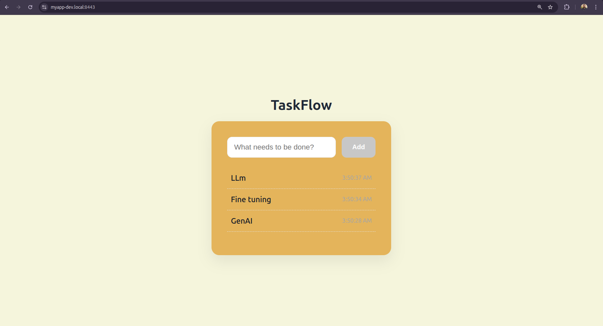

#  Production Deployment Guide — TaskFlow Todo Application

This document explains the **production-style Docker deployment** for **TaskFlow**, a full-stack Todo application built with **Vite (frontend)**, **Node.js + Express (backend)**, **MongoDB**, and **NGINX reverse proxy with HTTPS**.

The setup follows **CI-style deployment practices** including health checks, container restart policies, environment-based configuration, persistent volumes, and automated startup order.

---

##  Architecture Overview

Client (Vite SPA)
|
| HTTP / HTTPS
v
NGINX (Reverse Proxy + SSL)
|
| /todos
v
Node.js (Express API)
|
v
MongoDB (Persistent Volume)


---

## 🛠 Tech Stack

### Frontend
- Vite
- Single Page Application
- Served via NGINX

### Backend
- Node.js
- Express
- REST API
- Base route: `/todos`

### Database
- MongoDB 6
- Persistent Docker volume

### Infrastructure
- Docker
- Docker Compose v3.8
- NGINX (gateway + SSL)
- Health checks
- Restart policies
- Bridge networking

---

##  Project Structure

Day5/
├── certs/ # SSL certificates
├── client/ # Vite frontend
│ └── Dockerfile
├── nginx/
│ └── default.conf # NGINX reverse proxy config
├── server/
│ ├── src/
│ │ ├── api/
│ │ ├── config/
│ │ ├── loaders/
│ │ ├── models/
│ │ ├── repositories/
│ │ ├── services/
│ │ └── utils/
│ ├── Dockerfile
│ └── index.js
├── docker-compose.prod.yml
├── .env
├── deploy.sh
└── production-guide.md


---

##  Backend API Details

### Base Route
/todos


### Routes

```json
GET    /todos
POST   /todos
Route Registration
app.use('/todos', route);
Flow
Route → Controller → Service → Repository → MongoDB
✔ Clean separation of concerns
✔ Scalable backend design
✔ Production-ready structure
```

`Docker Compose Configuration`

MongoDB Service
Image: mongo:6

Health check using mongosh

Persistent volume for data safety

volumes:
  - mongo-data:/data/db
✔ Data survives container restarts
✔ Safe for production workloads

`Backend Service (Server)`

Built from ./server

Exposed internally on port 5000

Depends on healthy MongoDB

Health endpoint: /health

depends_on:
  mongo:
    condition: service_healthy
✔ Prevents startup race conditions
✔ Ensures DB availability before API starts

`Frontend Service (Client)`

Built from ./client

Vite-based application

Served internally via NGINX

No direct port exposure

✔ Clean separation between UI and gateway
✔ Browser never talks directly to backend

`NGINX Gateway`
Acts as:

Reverse proxy

SSL terminator

Single entry point

Ports:

8081 → HTTP

8443 → HTTPS

ports:
  - "8081:80"
  - "8443:443"
✔ Centralized traffic control
✔ Production-style gateway pattern

### Screenshots :



 `Environment Configuration`

Environment variables are injected via Docker Compose:

PORT=5000
MONGO_URI=mongodb://mongo:27017/taskflow
NODE_ENV=development
✔ No hardcoded secrets
✔ CI/CD compatible
✔ Easy environment switching

`Health Checks`

MongoDB
test: ["CMD", "mongosh", "--eval", "db.adminCommand('ping')"]
Backend API
test: ["CMD", "curl", "-f", "http://localhost:5000/health"]
✔ Enables automatic recovery
✔ Prevents broken dependencies
✔ Improves system stability

` Restart Policy`

All services use:

restart: always
✔ Containers auto-restart on crash
✔ Suitable for production & CI environments

` Persistent Storage`
Named Volume
volumes:
  mongo-data:
Used by MongoDB:

- mongo-data:/data/db
✔ Data remains intact after:

Container restart

Docker daemon restart

Application redeploy

`Networking`

Custom bridge network: app_network

Internal DNS-based service discovery

Secure container-to-container communication

✔ No hardcoded IPs
✔ Docker-native networking

` Deployment Workflow`

Production Startup
docker compose -f docker-compose.prod.yml up -d --build

`Automated Deployment`

./deploy.sh

`Typical flow:`

Build images

Apply environment variables

Start services in correct order

Enforce health checks

Enable auto-restart