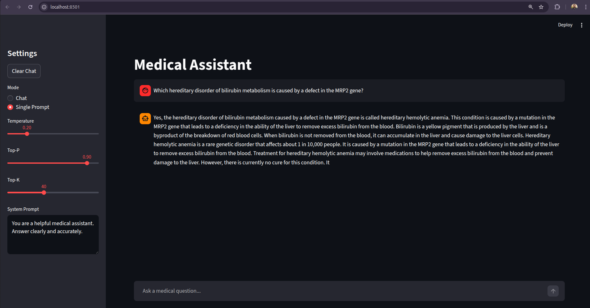
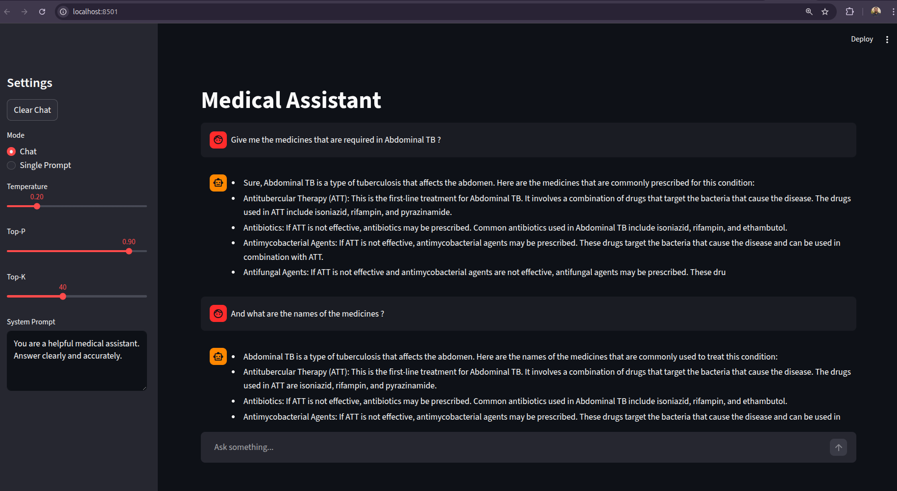

# Day 5 — Capstone: Build & Deploy Local LLM API

> A fully containerised, production-ready local LLM inference API built with FastAPI, llama-cpp-python, and a Streamlit UI — featuring real-time streaming, structured prompt templates, model caching, and Docker deployment.

---

## Table of Contents

- [Learning Outcomes](#learning-outcomes)
- [Topics Covered](#topics-covered)
- [Project Structure](#project-structure)
- [Capstone Features](#capstone-features)
- [Setup & Installation](#setup--installation)
- [Running the App](#running-the-app)
- [API Reference](#api-reference)
- [Streaming Logic](#streaming-logic)
- [Configuration](#configuration)
- [Docker Deployment](#docker-deployment)
- [Deliverables](#deliverables)

---

## Learning Outcomes

- Serve a quantised LLM as a **local microservice** using FastAPI
- Implement **real-time token streaming** for both single-prompt and chat modes
- Structure a **production-ready** codebase ready for RAG pipelines and agent frameworks

---

## Topics Covered

- **FastAPI inference server** — REST endpoints with `StreamingResponse`
- **Streamed generations** — token-by-token output using `stream=True` in llama-cpp-python
- **Prompt templates** — structured `<|system|>`, `<|user|>`, `<|assistant|>` formatting
- **Model caching** — singleton pattern with thread-safe double-checked locking
- **Production thinking** — request IDs, latency logging, Docker multi-service setup

---

## Project Structure

```
├── deploy/
│   ├── app.py              # FastAPI server with streaming endpoints
│   ├── model_loader.py     # Singleton model loader with thread lock
│   ├── config.py           # Centralised config (paths, defaults, system prompt)
│   ├── logger.py           # Structured logger
│   └── ui.py               # Streamlit frontend
├── quantized/
│   └── model.gguf          # Quantised GGUF model (not committed to git)
├── DockerFiles/
│   ├── Backend/
│   │   ├── Dockerfile
│   │   └── requirements.txt
│   └── UI/
│       ├── Dockerfile
│       └── requirements.txt
├── docker-compose.yml
└── README.md
```

---

## Capstone Features

| Feature | Status |
|---|---|
| Uses quantised GGUF model | ✅ |
| Infinite chat mode | ✅ |
| System + user prompt support | ✅ |
| Top-k, Top-p, Temperature controls | ✅ |
| Real-time token streaming | ✅ |
| Request ID + latency logging | ✅ |
| Dockerised (Backend + UI) | ✅ |
| Streamlit UI | ✅ |
| Ready for RAG / Agents | ✅ |

---

## Setup & Installation

### Prerequisites

- Python 3.10+
- Docker & Docker Compose
- A quantised `.gguf` model file (e.g. TinyLlama, Mistral, Phi)

### Local (Without Docker)

```bash
# Install backend dependencies
pip install fastapi uvicorn pydantic llama-cpp-python sentencepiece

# Place your model
mkdir quantized
cp /path/to/your/model.gguf quantized/model.gguf

# Start the API server
uvicorn deploy.app:app --host 0.0.0.0 --port 8000

# In a separate terminal, start the UI
pip install streamlit requests
streamlit run deploy/ui.py
```

---

## Running the App

### With Docker Compose

```bash
docker-compose up --build
```

- **Backend API** → `http://localhost:8000`
- **Streamlit UI** → `http://localhost:8501`
- **API Docs (Swagger)** → `http://localhost:8000/docs`

---

## API Reference

### `POST /generate`

Single-turn prompt with streamed response.

**Request Body**
```json
{
  "prompt": "What are the symptoms of diabetes?",
  "max_tokens": 256,
  "temperature": 0.7,
  "top_p": 0.9,
  "top_k": 40
}
```

### POST /generate :-> 


**Response** — `text/plain` stream of tokens

---

### `POST /chat`

Multi-turn conversation with streamed response.

**Request Body**
```json
{
  "messages": [
    { "role": "system", "content": "You are a medical assistant." },
    { "role": "user",   "content": "What is hypertension?" }
  ],
  "temperature": 0.7,
  "top_p": 0.9,
  "top_k": 40
}
```
### POST /Chat :-> 


**Response** — `text/plain` stream of tokens, with `X-Request-ID` header

---

## Streaming Logic

Both endpoints use `StreamingResponse` to yield tokens as they are generated by the model.

```python
def stream_llm():
    for chunk in model(prompt, ..., stream=True):
        text = chunk["choices"][0]["text"]
        if text:
            yield text

return StreamingResponse(stream_llm(), media_type="text/plain")
```

On the Streamlit frontend, `st.write_stream()` consumes the generator and renders tokens live into the chat bubble.

---

## Configuration

All defaults are centralised in `deploy/config.py`:

| Parameter | Default | Description |
|---|---|---|
| `MAX_TOKENS` | `256` | Max tokens to generate |
| `TEMPERATURE` | `0.7` | Sampling temperature |
| `TOP_P` | `0.9` | Nucleus sampling |
| `TOP_K` | `40` | Top-K sampling |
| `CONTEXT_WINDOW` | `2048` | Model context length |
| `MODEL_PATH` | `quantized/model.gguf` | Path to GGUF model (overridable via env) |

Override `MODEL_PATH` at runtime via environment variable:

```bash
export MODEL_PATH=/absolute/path/to/model.gguf
```

---

## Docker Deployment

### Backend (`DockerFiles/Backend/Dockerfile`)

- Base image: `python:3.10-slim`
- Installs build tools (`cmake`, `gcc`) required by `llama-cpp-python`
- Copies `deploy/` folder and `quantized/model.gguf`
- Exposes port `8000`

### UI (`DockerFiles/UI/Dockerfile`)

- Base image: `python:3.10-slim`
- Installs `streamlit` and `requests`
- Copies `deploy/` folder
- Exposes port `8501`

### Networking

The UI container communicates with the backend via the Docker internal hostname `http://backend:8000`, configured in `docker-compose.yml`.

---

## Deliverables

| File | Description |
|---|---|
| `deploy/app.py` | FastAPI server with `/generate` and `/chat` streaming endpoints |
| `deploy/model_loader.py` | Thread-safe singleton model loader |
| `deploy/config.py` | Centralised configuration |
| `deploy/ui.py` | Streamlit chat UI |
| `DockerFiles/Backend/Dockerfile` | Backend container definition |
| `DockerFiles/UI/Dockerfile` | UI container definition |
| `README.md` | This file |

---

> **Note:** The `.gguf` model file is not included in the repository due to its size. Download a compatible quantised model (e.g. from HuggingFace) and place it at `quantized/model.gguf` before running.