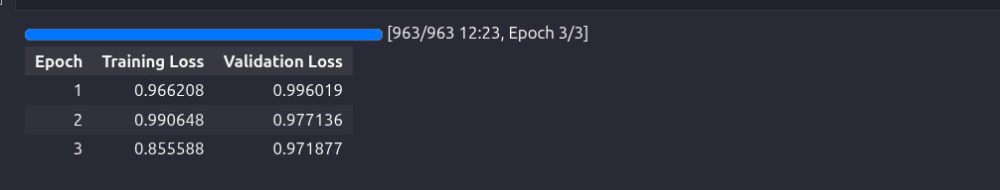

# Day 2 — Parameter-Efficient Fine-Tuning (LoRA / QLoRA)

## Overview

This repository contains the work completed for **Day 2** of the LLM Fine-Tuning challenge. The focus of this day was on fine-tuning a Large Language Model on **Google Colab** using **QLoRA** (Quantized Low-Rank Adaptation) — a parameter-efficient approach that makes LLM fine-tuning accessible on consumer-grade GPUs with limited VRAM.

The model was trained on the medical instruction-tuning dataset prepared in Day 1, and the final LoRA adapter weights have been saved to the `/adapters` directory.

---

## Learning Outcomes

- Fine-tune an LLM end-to-end on Google Colab
- Apply LoRA / QLoRA for parameter-efficient fine-tuning
- Use memory-saving tricks to fit large models in limited GPU memory
- Train with 4-bit / 8-bit quantization using BitsAndBytes

---

## Topics Covered

- PEFT — Parameter Efficient Fine-Tuning and why it matters
- LoRA hyperparameters — Rank (`r`), Alpha, and Dropout
- BitsAndBytes — 4-bit NF4 quantization for memory efficiency
- Gradient checkpointing — trading compute for memory
- Mixed precision training — FP16 for faster, lighter training

---

## Model & Setup

### Base Model

| Property      | Value                              |
|---------------|------------------------------------|
| Model         | `TinyLlama/TinyLlama-1.1B-Chat-v1.0` |
| Parameters    | ~1.1 Billion                       |
| Quantization  | 4-bit NF4 (QLoRA)                  |
| Platform      | Google Colab (GPU)                 |

### Environment

```bash
pip install transformers accelerate peft bitsandbytes datasets trl
```

---

## QLoRA Configuration

### 4-bit Quantization — `BitsAndBytesConfig`

The base model is loaded in **4-bit NF4** format to drastically reduce VRAM usage, making it possible to fine-tune a 1.1B model on a free Colab GPU.

```python
BitsAndBytesConfig(
    load_in_4bit              = True,
    bnb_4bit_quant_type       = "nf4",
    bnb_4bit_compute_dtype    = torch.float16,
    bnb_4bit_use_double_quant = True
)
```

| Parameter              | Value       |
|------------------------|-------------|
| Quantization bits      | 4-bit       |
| Quantization type      | NF4         |
| Compute dtype          | FP16        |
| Double quantization    | Enabled     |

### LoRA Configuration — `LoraConfig`

LoRA injects trainable low-rank matrices into the attention layers, keeping ~99% of the base model frozen. Only the adapter weights are updated during training.

```python
LoraConfig(
    r             = 16,
    lora_alpha    = 32,
    lora_dropout  = 0.05,
    bias          = "none",
    task_type     = "CAUSAL_LM",
    target_modules = ["q_proj", "v_proj"]
)
```

| Parameter        | Value              |
|------------------|--------------------|
| Rank (`r`)       | 16                 |
| Alpha            | 32                 |
| Dropout          | 0.05               |
| Bias             | none               |
| Target Modules   | `q_proj`, `v_proj` |
| Task Type        | CAUSAL_LM          |

---

## Dataset & Prompt Format

The tokenized dataset was loaded from the JSONL files prepared in Day 1 (`train.jsonl` and `val.jsonl`) and formatted using the following prompt template before tokenization:

```
### Instruction:
{instruction}

### Input:
{input}

### Response:
{output}
```

| Property          | Value       |
|-------------------|-------------|
| Max token length  | 256         |
| Padding           | max_length  |
| Truncation        | Enabled     |

---

## Training Configuration — `TrainingArguments`

| Parameter                | Value              |
|--------------------------|--------------------|
| Batch size (Train)       | 4                  |
| Batch size (Eval)        | 4                  |
| Learning rate            | 2e-4               |
| Epochs                   | 3                  |
| Logging steps            | 50                 |
| Evaluation strategy      | Per epoch          |
| Save strategy            | Per epoch          |
| Precision                | FP16               |
| Gradient checkpointing   | Enabled            |
| Optimizer                | `paged_adamw_8bit` |
| Output directory         | `/content/lora_outputs` |

---

## Memory-Saving Techniques Used

Three key techniques were combined to make training possible within Colab's VRAM limits:

**4-bit NF4 Quantization** — The base model weights are loaded in 4-bit precision using BitsAndBytes, reducing model memory footprint by ~4x compared to FP32.

**Gradient Checkpointing** — Instead of storing all intermediate activations in memory during the forward pass, activations are recomputed during the backward pass. This trades a small amount of compute for significant memory savings.

**Paged AdamW 8-bit Optimizer** — The `paged_adamw_8bit` optimizer keeps optimizer states in CPU memory and pages them to GPU only when needed, avoiding OOM errors during training.

---

## Training Results

| Metric                     | Result  |
|----------------------------|---------|
| Trainable parameters       | ~1% of total |
| Loss                       | Optimizing ✅ |
| Adapter weights saved      | ✅      |


### Epochs Loss for All three Iterations :-> 


---

## Adapter Weights — Output

After training, only the LoRA adapter weights (not the full model) are saved. These can be loaded on top of the frozen base model at inference time.

```python
adapter_path = "/content/adapters"
trainer.model.save_pretrained(adapter_path)
tokenizer.save_pretrained(adapter_path)
```

### Saved Files — `/adapters`

```
adapters/
├── adapter_config.json
├── adapter_model.bin
├── tokenizer_config.json
├── tokenizer.model
├── special_tokens_map.json
└── tokenizer.json
```

---

## Deliverables

```
/notebooks/lora_train.ipynb       ✅
/adapters/adapter_model.bin       ✅
/TRAINING-REPORT.md               ✅
README.md                         ✅
```