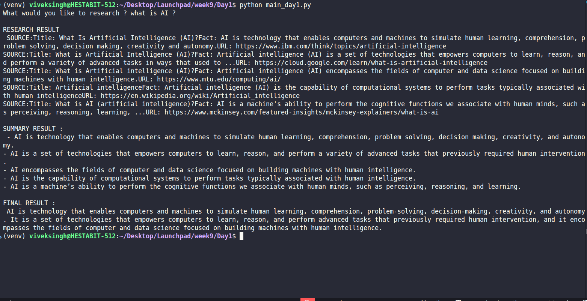

# AGENT FUNDAMENTALS — DAY 1  
**Agent Foundations & Message-Based Communication**

---

## 1. What is an AI Agent?

An **AI Agent** is an autonomous system that:
- Receives input (message/task)
- Reasons about what to do
- Takes actions (optionally using tools)
- Produces an output within a defined role

Unlike a chatbot, an agent **decides**, not just responds.

---

## 2. Agent vs Chatbot vs Pipeline

**Chatbot**
- Single prompt → response
- No autonomy or role separation

**Pipeline**
- Fixed steps
- No decision-making

**Agent System**
- Role-based components
- Autonomous reasoning
- Tool usage
- Message-based coordination

---

## 3. Agent Architecture (Day 1)

User → Research Agent → Summarizer Agent → Answer Agent

Each agent:
- Has a unique role
- Has its own system prompt
- Communicates only via messages
- Does not share internal state

---

## 4. Perception → Reasoning → Action Loop

Agents operate using:
1. Perception (receive task)
2. Reasoning (decide action)
3. Action (tool call or response)
4. Observation (tool result)
5. Final output

The **Research Agent** explicitly follows this loop.

---

## 5. ReAct Pattern

**ReAct = Reason + Act**

Thought → Action → Observation → Final

This pattern:
- Enables tool usage
- Reduces hallucination
- Makes agent behavior explicit

---

## 6. Message-Based Communication

Agents do not call each other directly.

- Output of one agent is passed as text to the next
- Memory is explicit and controlled
- Debugging is simple and transparent

---

### ScreenShot :-> 

## 7. Role Isolation

**Research Agent**
- Collects factual data
- Uses tools
- Does NOT summarize or answer

**Summarizer Agent**
- Extracts key facts
- No opinions or new data

**Answer Agent**
- Answers using ONLY the summary
- Refuses to hallucinate
- Returns “Not enough data” if required

---

## 8. Tools

Tools represent **actions**, not reasoning.

- Only Research Agent has tool access
- Tool execution is decided by the agent
- Agents do not know implementation details

---

## 9. Memory Handling (Day 1)

- No implicit memory window in the framework
- Each agent run is stateless
- Memory is controlled by message passing
- Conceptually equivalent to `memory_window = 10`

---

## 10. Key Learnings

- Agent correctness depends on constraints
- Tool inputs must be dynamic (not hardcoded)
- Guardrails prevent hallucination
- Short, safe answers are preferred
- Debugging requires inspecting intermediate outputs

---

**Day 1 Complete.**