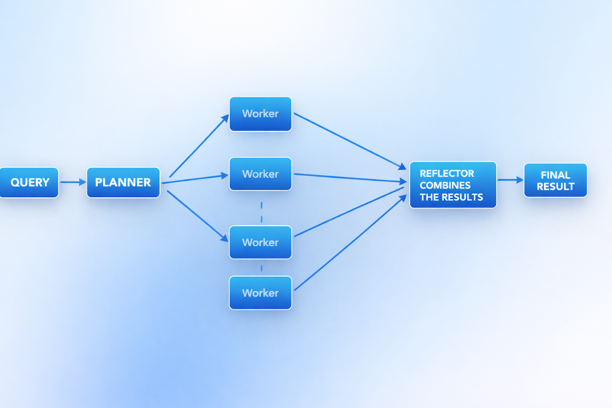

# DAY 2 — Multi-Agent Orchestration
## Planner → Workers → Validator

---

## Learning Outcomes

- Designing agent hierarchies
- Task planning and delegation logic
- Chain-of-command structure
- DAG-based parallel execution

---

## Architecture Overview

The system implements a **4-Agent Architecture** where each agent has a distinct role and communicates in a directed graph flow.

### Agents

| Agent | Role |
|---|---|
| **Orchestrator / Planner** | Breaks user query into parallel subtasks |
| **Worker Agent(s)** | Executes individual subtasks independently |
| **Reflection Agent** | Synthesizes all worker outputs into one answer |
| **Validator Agent** | Checks correctness and completeness of final answer |

---

## Execution Flow : 



---

## File Structure

```
day2/
│
├── main_day2.py                  # Entry point — orchestrates full pipeline
│
├── loader.py                     # LLM client loader (LLMclient)
│
├── orchestrator/-
│   └── planner.py                # Planner Agent — task decomposition
│
├── agents/
│   ├── worker_agents.py          # Worker Agent — executes subtasks
│   └── validator_agent.py        # Validator Agent — validates final answer
│
└── FLOW-DIAGRAM.md               # This file
```

---

## Agent Details

### Planner Agent
**File:** `/orchestrator/planner.py`

- Receives the raw user query
- Decomposes it into independent parallel subtasks (up to `WORKER_LIMIT = 3`)
- Returns a structured `PlannerResult` containing a list of `Task` objects
- Each task includes: `worker_name`, `task`, and `instructions`

**Output Schema:**
```json
{
  "tasks": [
    {
      "worker_name": "string",
      "task": "string",
      "instructions": "string"
    }
  ]
}
```

---

### Worker Agent
**File:** `/agents/worker_agents.py`

- One instance is created per task from the planner
- Each worker runs **in parallel** within the DAG graph
- Executes its assigned subtask using the provided instructions
- Passes output to the Reflection Agent

---

### Reflection Agent
**File:** `main_day2.py` (inline `AssistantAgent`)

- Waits for **all** worker outputs (fan-in node in the DAG)
- Synthesizes them into a single coherent, well-structured answer
- Does **not** add new facts or validate correctness
- Passes final synthesis to the Validator Agent

---

### Validator Agent
**File:** `/agents/validator_agent.py`

- Receives the synthesized answer from the Reflection Agent
- Checks for correctness and completeness
- Returns structured JSON with validation status and any issues found

**Output Schema:**
```json
{
  "is_valid": true,
  "issues": []
}
```

---

## DAG Execution Graph

The execution graph is built using `DiGraphBuilder` from `autogen_agentchat.teams`:

```
Workers (parallel) ──► Reflector ──► Validator
```

- Each Worker node has a **directed edge** to the Reflector (fan-in)
- Reflector has a **directed edge** to the Validator
- `GraphFlow` manages parallel execution and message routing

---

## Execution Tree (Runtime Output)

At the end of each run, the following tree is printed to console:

```
EXECUTION TREE

START → Planner
   |-- Worker 0: <worker_name> → Reflector
   |-- Worker 1: <worker_name> → Reflector
   |-- Worker 2: <worker_name> → Reflector
   |-- Reflector → Validator
   |-- FINAL OUTPUT
```

---

## Key Concepts Used

### Planner–Executor Architecture
The Planner decomposes the problem; Workers execute independently without knowledge of each other.

### DAG-Based Execution
Tasks are modeled as a Directed Acyclic Graph — workers run in parallel, results converge at the Reflector.

### Task Graph Generation
The graph topology is **dynamic** — generated at runtime based on the Planner's JSON output.

### Agent Registry Pattern
Workers are instantiated from a loop over `plan.tasks`, creating a dynamic registry of named agents attached to the graph.

---

## Constraints

- Maximum **3 parallel workers** enforced by `WORKER_LIMIT`
- All agent outputs must be valid JSON where structured responses are required
- Markdown code fences are stripped before JSON parsing
- If Reflector or Validator output is missing, a `RuntimeError` is raised