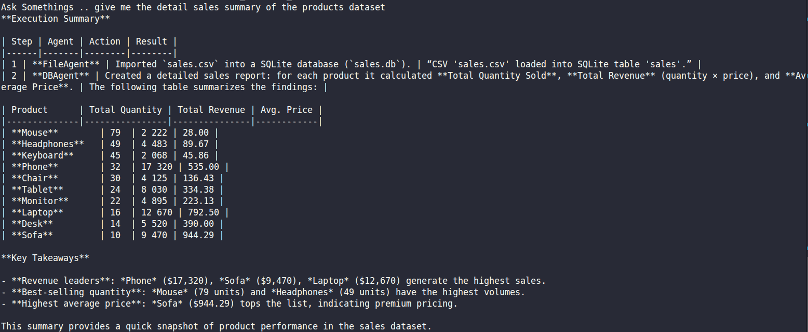

## DAY 3 — Tool Calling Agents (Code, Files, Database, Search)

---

## Goal of Day 3

The primary goal of Day 3 was to build a **tool-enabled multi-agent system** where agents do not just reason, but can also:

* Execute Python code
* Read and write files
* Load and query databases
* Interact with structured data
* Perform real-world system actions

This day introduced **grounded execution**, where LLM decisions trigger actual system operations.

---

## Core Learning Outcome

Day 3 taught us that:

* LLMs **do not execute code directly**
* LLMs only generate structured tool-call tokens
* The framework (AutoGen) executes real tools
* Tool outputs are fed back to the LLM
* The final answer is grounded in real system results

---

## Architecture Overview

### Full Flow

User
↓
Orchestrator
↓
PlannerAgent
↓
FileAgent / DBAgent / CodeAgent
↓
Real Tool Execution
↓
SummarizerAgent
↓
Final Output

---

## Agents Built in Day 3

### ### PlannerAgent

#### Responsibility

* Reads user query
* Generates structured execution plan (JSON)
* Decides which agent should handle each step

#### Important Notes

* Does NOT execute tools
* Does NOT generate SQL
* Does NOT access files
* Only produces structured plan

---

### ### FileAgent

#### Responsibility

Handles all file operations:

* Inspect CSV structure
* Read CSV rows
* Load CSV into SQLite
* Read .txt files
* Write .txt files
* Append .txt files
* Delete .txt files

#### Strict Rules

* Must use tools for file operations
* Cannot execute Python code
* Cannot generate SQL
* Cannot access database directly

---

### ### DBAgent

#### Responsibility

* Runs SELECT / WITH SQL queries
* Performs aggregation
* Handles filtering
* Executes safe read-only SQL

#### Important Rules

* Only SELECT / WITH queries allowed
* No INSERT, DELETE, UPDATE
* Must rely on schema
* Returns structured query results

---

### ### CodeAgent

#### Responsibility

* Generates Python code when required
* Executes Python code using tool
* Returns actual execution output

#### Important Notes

* Uses LocalCommandLineCodeExecutor
* Python runs on local machine
* LLM only generates code — framework executes it

---

### ### SummarizerAgent

#### Responsibility

* Converts multi-step execution logs
* Produces clean human-readable final output

---

## Screenshot : 



## Tools Created

All tools were wrapped using:

```python
FunctionTool
```

Tools are converted into OpenAI-style JSON schemas before being sent to the LLM.

---

### ### File Tools

* inspect_csv
* read_csv
* write_csv
* load_csv_to_sqlite
* read_txt
* write_txt
* append_txt
* delete_txt

---

### ### Database Tools

* extract_schema
* schema_aware_query

---

### ### Code Execution Tool

* PythonCodeExecutionTool
* Uses LocalCommandLineCodeExecutor

---

## How Tool Calling Actually Works

### Step-by-Step Internal Flow

### LLM Receives Tool Schemas

AutoGen extracts tool metadata and sends schema like:

```json
{
  "name": "inspect_csv",
  "parameters": {
    "type": "object",
    "properties": {
      "file_path": { "type": "string" }
    }
  }
}
```

---

### LLM Generates Tool Call (Not Execution)

Example output:

```json
{
  "tool_calls": [
    {
      "name": "inspect_csv",
      "arguments": {
        "file_path": "data/sales.csv"
      }
    }
  ]
}
```

LLM is only generating tokens.

---

### AutoGen Detects Tool Call

Framework parses:

* Tool name
* Arguments

---

### Python Executes Tool

Example:

```python
inspect_csv("data/sales.csv")
```

Real file read happens.

---

### Tool Result Returned to LLM

Tool output is inserted into conversation as:

```json
{
  "role": "tool",
  "content": "{...}"
}
```

---

### LLM Generates Final Response

Now LLM responds using grounded tool data.

---

## Dataset Used

### sales.csv

Contains columns:

* Order ID
* Product
* Quantity Ordered
* Price
* Order Date
* Time
* Purchase Address
* City
* Product Type

This is the raw dataset.

---

### sales.db

SQLite database created from sales.csv.

Purpose:

* Perform accurate aggregation
* Execute GROUP BY queries
* Calculate SUM, COUNT, etc.
* Avoid hallucinated math

---

## Key Debugging Learnings

### SQLite Automatically Creates DB Files

If LLM provides wrong DB name, SQLite creates empty database silently.

Lesson:

* Never let LLM control DB path
* Hardcode infrastructure paths

---

### Strict Mode Issue

Using strict=True in FunctionTool requires:

* No default arguments
* All parameters required

Solution:

* Remove strict=True OR remove default args

---

### Natural Language Ambiguity

Example:
“Total number of laptops”

Could mean:

* COUNT(*) → number of rows
* SUM(Quantity Ordered) → total units

LLM interpreted as SUM.

Lesson:

* Be precise in queries
* Or define default interpretation rule

---

### Planner Hallucination

Planner assumed laptops.csv existed.

Lesson:

* Inject real dataset constraints
* Ground planner with schema
* Restrict allowed file names

---

## What Day 3 Achieved

By end of Day 3, the system can:

* Read structured datasets
* Load data into database
* Perform SQL analytics
* Execute Python code
* Chain multi-agent workflows
* Ground responses in real system outputs

This is no longer a chatbot.

This is a **controlled multi-agent execution system**.

---

## Conceptual Progression

Day 1 → Agents think
Day 2 → Agents coordinate
Day 3 → Agents act on real systems

You built:

* Tool-enabled reasoning
* Orchestrated execution
* Real data grounding
* Infrastructure-aware AI

---

## Final Understanding

LLM:

* Only generates tokens
* Decides which tool to call

AutoGen:

* Parses tool call
* Executes Python
* Sends results back

System:

* Combines reasoning + execution
* Produces grounded output

---

## End Result

You now have a working:

* Multi-agent system
* With tool calling
* With database integration
* With code execution
* With file operations
* With controlled orchestration

This is foundational infrastructure for:

* AI Data Assistants
* Autonomous Analytics Systems
* AI Copilots
* Enterprise Tool Agents

---

**Day 3 Complete.**
